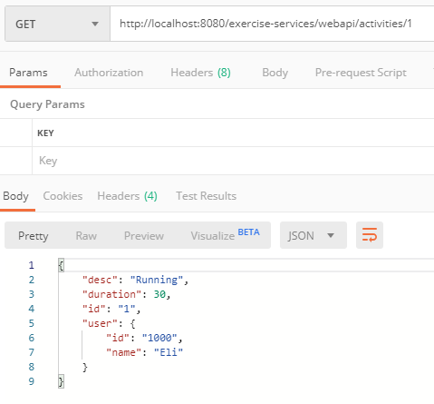

# RESTful-Web-API
Exercise tracking web service using Java and REST   
Technologies used:  
<ul>
  <li>Maven: build automation</li>
  <li>Tomcat: local web server</li>
  <li>Jersey: RESTful web services framework</li>
  </ul>
  
   
  Follows the Richardson Maturity Model up to Level 2: 
  Level 1: Resources - focused on nouns and accessed through URIs 
  Level 2: HTTP Verbs - interaction with resources through HTTP verbs 
  Level 3: Hypermedia - client interacts with server through hypermedia  
  
   
  
  Classes:
  <ul>
  <li>Activity: model for data</li>
  <li>ActivityRepository: store Activity data and methods that interact with Activity data</li>
  <li>ActivityResource: methods for each HTTP verb</li>
  <li>ActivityClient: web client to call ActivityResource methods through HTTP verbs</li>
  <li>ActivityClientTest: validates method and returned object correctness</li>
  </ul>
  
   
  HTTP Verbs: 
  GET:
  
  
 
  POST:
  
  
   
  POST JSON:
  
  
   
  PUT:
  
  
   
  DELETE:
  
  
  
    
  JUnit Results: 
    
